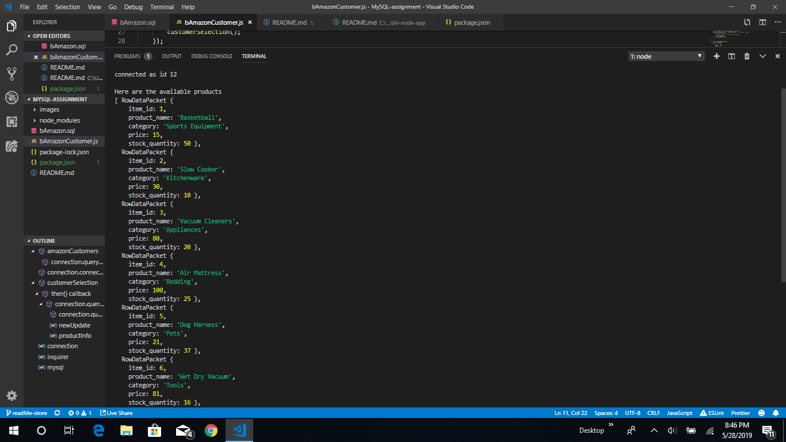

# MySQL-Assignment
MySQL assignment for the Coding Bootcamp at UT Austin. 

In this assignment, I am creating an online store, similar to Amazon using the MySQL database and Node.JS. 

## Creating the Application
When I first saw the specifications of the project, I knew that this project was inspired by Amazon.   
The technologies that were used in this project were MySQL for the database and Node.JS.   
To make Node.js sync with MySQL, I had to use the npm MySQL package.   
In addition, to create prompts, I used the inquirer package.   

## Challenges of completing the project
One of the biggest challenges of completing the project was getting MySQL and Node.js to work in sync.  
Originally, I had used MAMP, which is MacOS (operating system), Apache (Web Server), MySQL (database) and either PHP, Perl, or Python.   
What happened when I used MAMP is that the Apache server loaded relatively quickly. However, the MySQL database took forever to load.  
After chatting with my instructor, he suggested that I 
1. Delete the MAMP application from the computer
2. Go to services, check to see if MySQL is running
3. If MySQL is not running, make sure that it is running.  

## Executing the application
To execute this program, use this command: **node bAmazonCustomer.js**  
**bAmazonCustomer.js** is my JavaScript file for customers. 

Once I execute the application, I get a list of items to purchase in the store. 

Let us try to purchase an item that we want that is in the store.  
For example, I am going to try to purchase item 8, a TV.  
In addition, I am going to buy 9 of these, despite the fact there are only 6 in stock. 

I get this result. The order does not go through when I try to buy more items than are in stock. 

Now, I am going to try to purchase item 6, a Wet Dry Vacuum.   
In addition, I am going to buy 10 of these, knowing that I have 30 in stock.   

I get this result. The order goes through and the user is told the total cost.  
In addition, the stock_quantity is updated.   
This amount is lowered by the quantity ordered.   